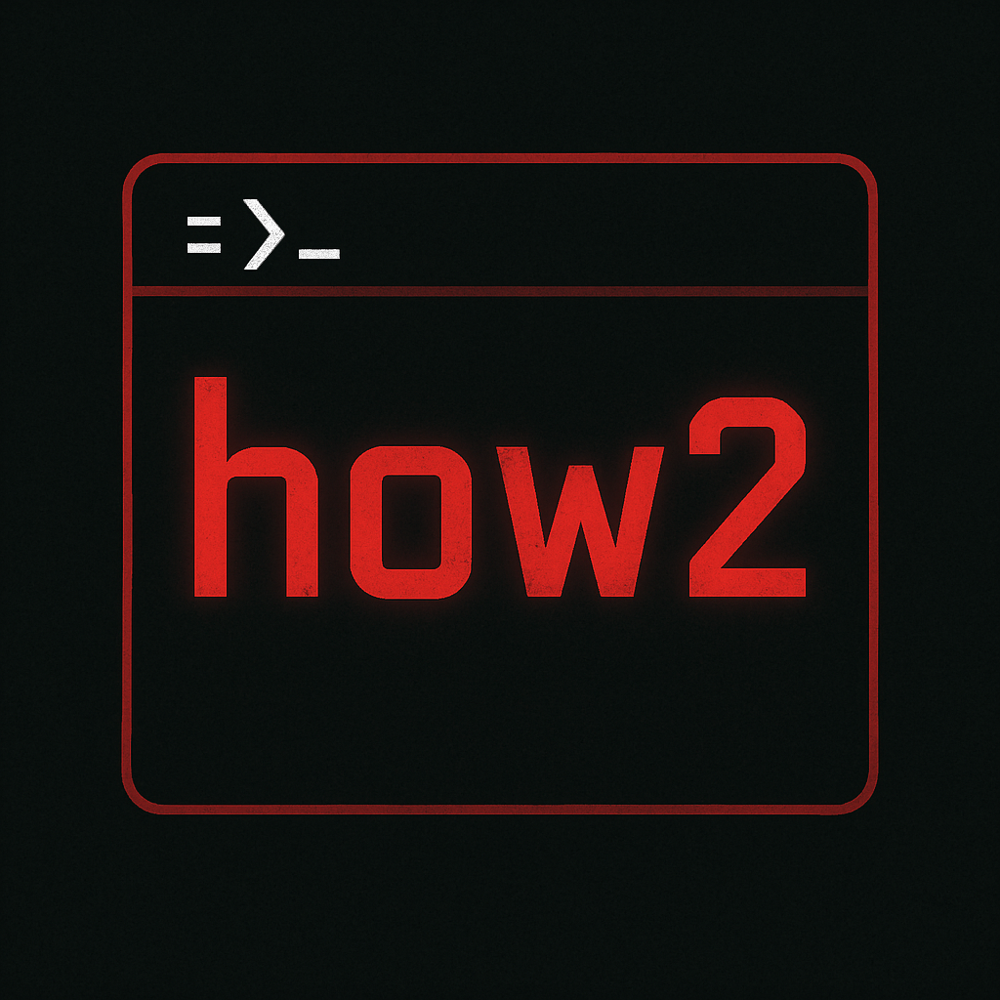

  

  <h1 class="techy-title">Welcome to How2Red</h1>

  
Try. Fail. Learn. Try Again. Get Better.

<a href="Windows/" class="md-button md-button">Windows TTPs</a>
<a href="Linux/" class="md-button">Linux TTPs</a>
<a href="Test/" class="md-button">Just a Test</a>

# Welcome to MkDocs

For full documentation visit [mkdocs.org](https://www.mkdocs.org).

## Commands

* `mkdocs new [dir-name]` - Create a new project.
* `mkdocs serve` - Start the live-reloading docs server.
* `mkdocs build` - Build the documentation site.
* `mkdocs -h` - Print help message and exit.

## Project layout

    mkdocs.yml    # The configuration file.
    docs/
        index.md  # The documentation homepage.
        ...       # Other markdown pages, images and other files.
