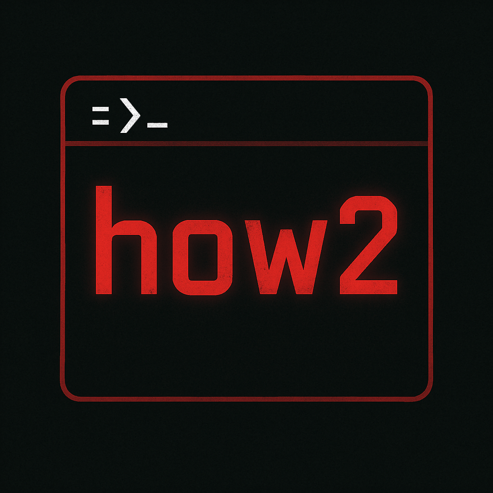

  

  <h1 class="techy-title">Welcome to How2Red</h1>

  
Try. Fail. Learn. Try Again. Get Better.

<a href="Windows/" class="md-button md-button">Windows TTPs</a>
<a href="Linux/" class="md-button">Linux TTPs</a>
<a href="Test/" class="md-button">Just a Test</a>

